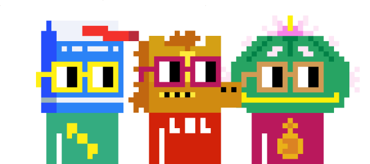

    
    <h1>Noun Nyms</h1>
    <strong>Noun Nyms is a protocol and webapp for using nounish pseudonyms.</strong>

 

	    
	

# Nym dev

     
    <a href="https://nouns.nymz.xyz/"><b>nouns.nymz.xyz »</b></a>
    <a href="https://nouns.nymz.xyz/api-doc"><b>Public API Docs »</b></a>
    <a href="https://discord.gg/3NQm99v3Vp"><b>Support »</b></a>

## How does it work?

### The proof

Nyms uses the [Spartan NIZK](https://eprint.iacr.org/2019/550) proving system to make [persistent name proofs](https://ethresear.ch/t/a-simple-persistent-pseudonym-scheme/14930).

The R1CS circuit defining the proof can be found [here](./packages/circuits/nym/nym_ownership.circom).

Users using the noun nyms frontend make 2 ECDSA signatures with their Eth key when they associate a name with a piece of content (i.e. a post or comment):

1. a signature of the nym being used
2. a signature of the content being posted

The former shows that the Eth key holder signing still has the ability to use the specified nym. The latter shows that the nym holder specified attests to the piece of content to be shared.

These two pieces of information are used as [private inputs in the zero-knowledge proof](https://github.com/personaelabs/noun-nyms/blob/main/packages/circuits/nym/nym_ownership.circom#L19-L37) computed on the user's device and are not shared with our webserver or anywhere else.

### Verifiable content graph and public API

The entire Noun Nyms 'content graph' is independently verifiable. This means that comment tree parent relationships and nym attestations can be independently observed and there's no way for the Personae team's servers to be serving faulty data.

The Personae team maintains the frontend at [nouns.nymz.xyz](https://nouns.nymz.xyz/) and also serves a public API for retrieving data that other frontends can consume. Documentation for this API can be found [here](https://nouns.nymz.xyz/api-doc)

We're working on documentation on how you might verify the content graph programmatically yourself- if you have any questions about this, come ask us in the [support discord](https://discord.gg/3NQm99v3Vp)!

## Packages

| Name                                   | Description                                 |
| -------------------------------------- | ------------------------------------------- |
| [circuits/](./packages/circuits)       | spartan circuit definitions                 |
| [nymjs/](./packages/nymjs)             | frontend lib for creating and using nyms    |
| [frontend/](./packages/frontend)       | noun nyms webapp                            |
| [merkle_tree/](./packages/merkle_tree) | merkle tree indexing service                |
| [db/](./packages/db)                   | postgres db schema                          |
| [test_data/](./packages/test_data)     | test data population for development builds |

## Contributing

If you're interested in contributing, see our [contribution guidelines](./CONTRIBUTING.md)!
